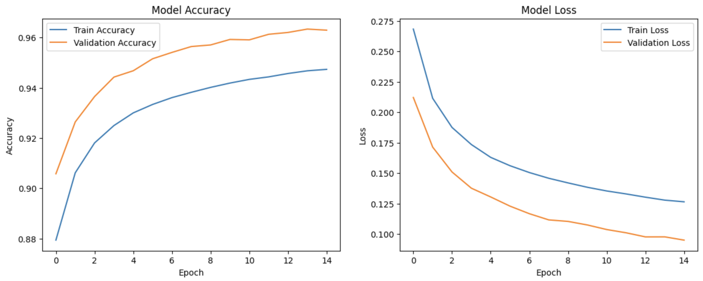

# **Predicting Red Hat Business Value**

# Table of Contents

- [Project Overview](#project-overview)
- [Data Overview](#data-overview)
- [Data Exploration](#data-exploration)
- [Data Cleaning and Preprocessing](#data-cleaning-and-preprocessing)
- [Model Development](#model-development)
- [Model Performance](#model-performance)
- [Model Deployment](#model-deployment)
- [Conclusion](#conclusion)


## Project Overview

In this project, a machine learning model was developed  to predict business value for Red Hat, using historical data on customer engagement and interactions. The goal was to improve decision-making by accurately forecasting the likelihood of a high business value outcome, allowing Red Hat to optimize its customer relationship management strategies.

## Problem Statement

### Situation

Red Hat, a leading provider of enterprise open-source software, relies on strong customer engagement to drive business value. The company collects vast amounts of data on customer activities and various characteristics.

### Complication

However, the challenge lies in identifying which of these activities and characteristics are most indicative of future business value. The high volume of data, combined with the complexity of customer behaviors, makes it difficult to manually assess and predict which customers will generate significant business value.

### Question

How can Red Hat accurately predict business value outcomes based on historical customer interaction data, thereby enabling more informed strategic decisions?

## Data Overview

- **People Dataset:** Contains features with 189,118 entries and 41 columns.
- **Train Dataset:** Includes historical outcomes and features with 2,197,291 entries and 15 columns.
- **Test Dataset:** Similar to the train dataset but without the outcome column, with 498,687 entries and 14 columns.

## Data Exploration

### Missing Values Analysis
- Identified columns with missing values in the train and test datasets.
- Dropped columns with more than 30% missing values.

### Data Merging
- The people dataset was successfully merged with both train and test datasets on the people_id column, resulting in comprehensive datasets for further analysis.

### Outcome Distribution Analysis
- The outcome column in the train dataset revealed a distribution of approximately:
    - Class 0: 55.60%
    - Class 1: 44.40%

## Data Cleaning and Preprocessing

- Missing values were imputed using the most frequent value (mode).
- Date related feature were extracted.
- Applied Label Encoding and One-Hot Encoding techniques to encode categorical features.
- Numerical columns were scaled using the Standard Scaler.
- The scaler object was saved as a .pkl file for future use during model deployment and individual predictions.

## Model Development

### Data spliting
```python
# Split dataset into train and test with ratio 80:20
X_train, X_test, y_train, y_test = train_test_split(X, y, test_size=0.2,random_state=42)

# Split the training dataset further into training and validation with the ratio 90:10
X_train, X_val, y_train, y_val = train_test_split(X_train, y_train, test_size=0.1, random_state=42)
```
 ### Baseline model 
 ```python
# Define the model
baseline_model = Sequential()

# Set up the input dimension
baseline_model.add(Input(shape=(165,)))

# Input layer
baseline_model.add(Dense(64, activation='relu'))

# Output layer
baseline_model.add(Dense(1, activation='sigmoid'))

# Compile the model
baseline_model.compile(optimizer=Adam(learning_rate=0.001), loss='binary_crossentropy', metrics=['accuracy'])

# Use early stopping to prevent overfitting and train the model
early_stopping = EarlyStopping(monitor='val_loss', patience=3, restore_best_weights=True)

history = baseline_model.fit(X_train, y_train, validation_data=(X_val, y_val),
                             epochs=50, batch_size=512, callbacks=[early_stopping], verbose=1)

# Evaluate Baseline Model
val_predictions = (baseline_model.predict(X_val) > 0.5).astype("int32")
baseline_accuracy = accuracy_score(y_val, val_predictions)
print(f'Baseline Model Accuracy: {baseline_accuracy:.4f}')
 ```
 - **Baseline Model Accuracy:** 92.14%

 ### Improved Deep Neural Network (DNN) Model

```python
# Define the DNN model
def build_dnn_model(input_shape):
    model = Sequential()

    # Define the inpute shape
    model.add(Input(shape=(input_shape,)))

    # Input layer
    model.add(Dense(512, activation='relu'))
    #model.add(BatchNormalization())
    model.add(Dropout(0.3))

    # First hidden layers
    model.add(Dense(256, activation='relu'))
    #model.add(BatchNormalization())
    model.add(Dropout(0.3))

    # Second hidden layer
    model.add(Dense(64, activation='relu'))
    #model.add(BatchNormalization())
    model.add(Dropout(0.3))
    
    # Output layer
    model.add(Dense(1, activation='sigmoid'))

    # Compile the model
    model.compile(optimizer=Adam(learning_rate=0.001),
                  loss='binary_crossentropy',
                  metrics=['accuracy'])
    
    return model

# Get the input shape from the training data
input_shape = X_train.shape[1]

# Build the model
dnn_model = build_dnn_model(input_shape=input_shape)

# Set up early stopping
early_stopping = EarlyStopping(monitor='val_loss', patience=10, restore_best_weights=True)

# Train the model
history = dnn_model.fit(X_train, y_train,
                        validation_data=(X_val, y_val),
                        epochs=15,
                        batch_size=512,
                        callbacks=[early_stopping])

# Evaluate the model on the test set
test_loss, test_accuracy = dnn_model.evaluate(X_test, y_test)
print(f"Improved DNN Model Accuracy: {test_accuracy:.4f}")
```
- **Improved DNN Model Accuracy:** 96.32%

## Model Performance

### Training & validation accuracy / loss values


### Confusion Matrix


- The confusion matrix shows that the model correctly classified most of the positive and negative cases, with a relatively low number of false positives and false negatives.

### Classification Report

| Class          | Precision | Recall | F1-Score | Support |
|----------------|:---------:|:------:|:--------:|:-------:|
| **0**          | 0.98      | 0.95   | 0.97     | 97,816  |
| **1**          | 0.94      | 0.98   | 0.96     | 77,968  |
| **Accuracy**   |           |        | 0.96     | 175,784 |
| **Macro Avg**  | 0.96      | 0.96   | 0.96     | 175,784 |
| **Weighted Avg** | 0.96    | 0.96   | 0.96     | 175,784 |

- **Precision:** High precision (0.98 for class 0 and 0.94 for class 1) indicates that when the model predicts a class, it’s usually correct.

- **Recall:** High recall (0.95 for class 0 and 0.98 for class 1) suggests that the model successfully identifies most of the actual instances of each class.

- **F1-Score:** The F1-scores (0.97 for class 0 and 0.96 for class 1) show a good balance between precision and recall.

- **Overall Accuracy:** 96% accuracy reflects strong overall performance.

- **Macro and Weighted Averages:** Both macro and weighted averages are 0.96, indicating balanced performance across classes.

### Receiver Operating Characteristic (ROC) Curve


- **ROC AUC:** A value of 0.99 indicates that the model has excellent discriminatory power, effectively distinguishing between the positive and negative classes.

## Model Deployment
The model was saved and an API endpoint was developed for real-time predictions. The endpoint allows users to input new data and receive predictions on business value outcomes, ensuring that the model can be easily integrated into Red Hat's operational systems.


A Flask API was created to serve the model for real-time predictions. The API accepts JSON input and returns the predicted price.

### API Endpoints:
- **/predict**: Takes house features as input and returns the predicted price.

## How to Use the API
1. **Clone the repository**:
    ```bash
    git clone https://github.com/Asante-Emma/red_hat_business_value.git
    ```
2. **Install dependencies**:
    ```bash
    pip install -r requirements.txt
    ```
3. **Run the API**:
    ```bash
    python app.py
    ```
4. **Make Predictions**:
    Send a POST request to `/predict` with the required features.

## Conclusion
This project successfully developed a robust machine learning model capable of predicting business value with high accuracy. The model's deployment enables Red Hat to leverage these predictions in their strategic decision-making processes, ultimately driving better business outcomes.